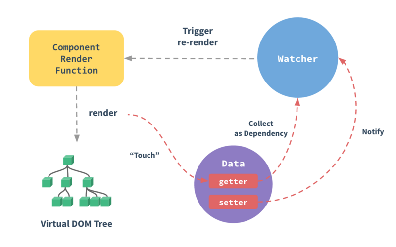
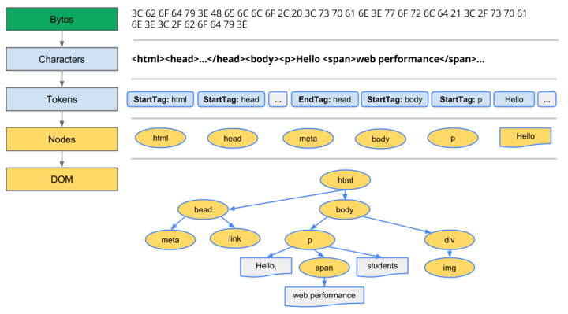
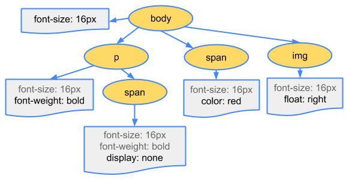
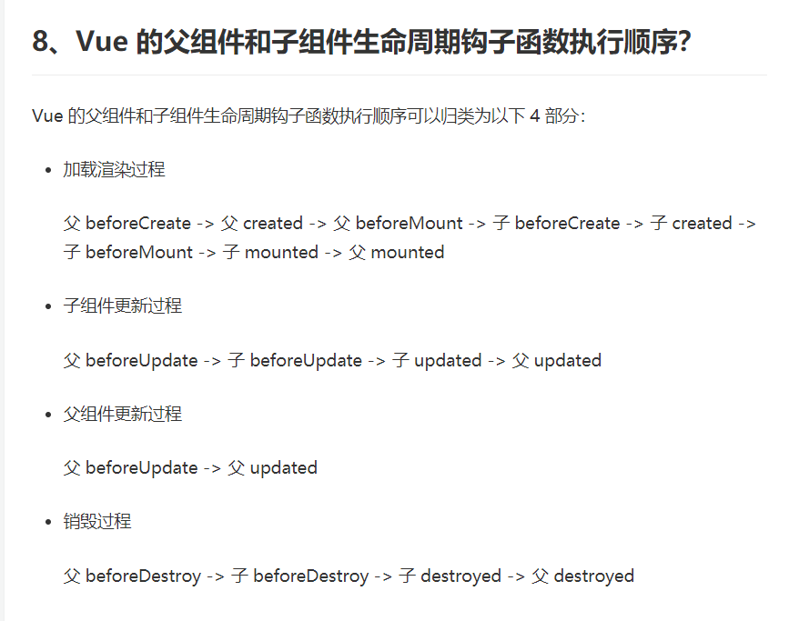

<!-- TOC -->

- [Doctype](#doctype)
- [垂直居中](#%e5%9e%82%e7%9b%b4%e5%b1%85%e4%b8%ad)
- [v-if && v-show](#v-if--v-show)
- [MVVM](#mvvm)
- [v-model的原理](#v-model%e7%9a%84%e5%8e%9f%e7%90%86)
- [vue双向绑定](#vue%e5%8f%8c%e5%90%91%e7%bb%91%e5%ae%9a)
- [箭头函数](#%e7%ae%ad%e5%a4%b4%e5%87%bd%e6%95%b0)
- [跨域问题](#%e8%b7%a8%e5%9f%9f%e9%97%ae%e9%a2%98)
- [页面的展现过程](#%e9%a1%b5%e9%9d%a2%e7%9a%84%e5%b1%95%e7%8e%b0%e8%bf%87%e7%a8%8b)
- [浏览器的渲染](#%e6%b5%8f%e8%a7%88%e5%99%a8%e7%9a%84%e6%b8%b2%e6%9f%93)
- [DOM树和CSSOM树](#dom%e6%a0%91%e5%92%8ccssom%e6%a0%91)
- [vuex](#vuex)
- [keep-alive](#keep-alive)
- [vue-router](#vue-router)
- [mockjs](#mockjs)
- [axios](#axios)
- [js-cookie](#js-cookie)
- [SPA](#spa)
- [webpack](#webpack)
- [vue生命周期](#vue%e7%94%9f%e5%91%bd%e5%91%a8%e6%9c%9f)
- [父子组件生命周期钩子函数执行顺序](#%e7%88%b6%e5%ad%90%e7%bb%84%e4%bb%b6%e7%94%9f%e5%91%bd%e5%91%a8%e6%9c%9f%e9%92%a9%e5%ad%90%e5%87%bd%e6%95%b0%e6%89%a7%e8%a1%8c%e9%a1%ba%e5%ba%8f)
- [diff算法](#diff%e7%ae%97%e6%b3%95)

<!-- /TOC -->

## Doctype
回答1： （1）、 声明位于文档中的最前面，处于标签之前。告知浏览器的解析器，用什么文档类型 规范来解析这个文档。 

（2）、严格模式的排版和JS 运作模式是以该浏览器支持的最高标准运行。 

（3）、在混杂模式中，页面以宽松的向后兼容的方式显示。模拟老式浏览器的行为以防止站点无法工作。              
            
（4）、DOCTYPE不存在或格式不正确会导致文档以混杂模式呈现。 

## 垂直居中

父元素固定宽高，利用定位及设置子元素margin值为自身的一半。

父元素固定宽高，子元素设置position: absolute，margin：auto平均分配margin。

css3属性transform。子元素设置position: absolute; left: 50%; top: 50%;transform: translate(-50%,-50%);即可。

将父元素设置成display: table, 子元素设置为单元格 display: table-cell。

弹性布局display: flex。设置align-items: center; justify-content: center;

## v-if && v-show
v-if 是真正的条件渲染，因为它会确保在切换过程中条件块内的事件监听器和子组件适当地被销毁和重建；也是惰性的：如果在初始渲染时条件为假，则什么也不做——直到条件第一次变为真时，才会开始渲染条件块。

v-show 就简单得多——不管初始条件是什么，元素总是会被渲染，并且只是简单地基于 CSS 的 “display” 属性进行切换。

所以，v-if 适用于在运行时很少改变条件，不需要频繁切换条件的场景；v-show 则适用于需要非常频繁切换条件的场景。

## MVVM
view HTML CSS 模板文件
ViewModel js runtime compiler
Model 业务逻辑 java

## v-model的原理
本质上不过是语法糖，v-model 在内部为不同的输入元素使用不同的属性并抛出不同的事件：

text 和 textarea 元素使用 value 属性和 input 事件；
checkbox 和 radio 使用 checked 属性和 change 事件；
select 字段将 value 作为 prop 并将 change 作为事件。

## vue双向绑定

当你把一个普通的 JavaScript 对象传入 Vue 实例作为 data 选项，Vue 将遍历此对象所有的属性，并使用 Object.defineProperty 把这些属性全部转为 getter/setter。

vuejs里每一个组件对应了一个watcher，Object.defineProperty是紫色的圆圈，当组件里某一个属性被get的时候，getter函数会通知Watcher，“说我这有一个属性被渲染了，你记一下”，然后当这个属性的setter被触发（也就是该属性数据被修改的时候），也会通知Watcher，说“我这有这样一个东西被改了，你看看在不在你的名单里。”Watcher此时去检查被改的属性在不在自己记录的名单里，如果在，就通知组件渲染程序，让它再去更新虚拟dom树。

1.getter/setter对用户是不可见的，是在vue内部实现的。

2.js里无法监听对象属性的增加或者删除，所以vue只能在开始data里添加响应式属性，所以当组件创建完毕，再给这个组件塞一个属性，这个属性是无法响应到dom的。

3.vue会在组件初始化的过程中进行getter/setter转换，所以也无法动态插入新属性，插入了也是非响应数据，但可以通过Vue.set(object, key, value)方法将属性加入到后台可响应的对象中。

4.官网还介绍了更新队列，上文说的Watcher中的更新会被推入到一个更新队列中，那么就是说数据更新后不会马上反映到dom上。

5.但是我们可以通过Vue.nextTick(callback)方法，将这次数据更新马上反映到dom上，这个方法的callback是dom更新完成的回调。

## 箭头函数
匿名函数
省略this
简洁
用于筛选

## 跨域问题
https://juejin.im/post/5c625e6d518825626463ad9c
解决方案

后端CORS
简单请求 get/post/head
contend-type请求头

预先请求:
浏览器必须首先使用 OPTIONS 方法发起一个预检请求（preflight request），从而获知服务端是否允许该跨域请求。

服务器确认允许之后，才发起实际的 HTTP 请求。在预检请求的返回中，服务器端也可以通知客户端，是否需要携带身份凭证（包括 Cookies 和 HTTP 认证相关数据）。

开发环境 webpack的proxy

生产环境 nginx 

首先，什么是跨域？跨域就是它是由浏览器的同源策略造成的，是浏览器施加的安全限制。

所谓同源是指，域名，协议，端口均相同，不明白可以看看下面的例子：

域名、子域名、端口、协议

http://www.123.com/index.html 调用 http://www.123.com/server.php （非跨域）

http://www.123.com/index.html 调用 http://www.456.com/server.php （主域名不同:123/456，跨域）

http://abc.123.com/index.html 调用 http://def.123.com/server.php （子域名不同:abc/def，跨域）

http://www.123.com:8080/index.html 调用 http://www.123.com:8081/server.php （端口不同:8080/8081，跨域）

http://www.123.com/index.html 调用 https://www.123.com/server.php （协议不同:http/https，跨域）
跨域防护CSRF攻击  CSRF概念：CSRF跨站点请求伪造(Cross—Site Request Forgery)
CSRF： 就是A网站给用户发了cookie B网站返回攻击性代码请求访问A网站，不是用户发的

## 页面的展现过程
1. DNS 解析:将域名解析成 IP 地址，返回给浏览器
  
DNS 协议提供通过域名查找 IP 地址，或逆向从 IP 地址反查域名的服务。DNS 是一个网络服务器，我们的域名解析简单来说就是在 DNS 上记录一条信息记录。
浏览器缓存-> 操作系统缓存 -> 路由器缓存 -> ISP的DNS服务器 -> 根服务器（.com）

2. TCP 连接：TCP 三次握手

为了防止已失效的连接请求报文段突然又传送到了服务端，因而产生错误

客户端发送一个带 SYN=1，Seq=X 的数据包到服务器端口（第一次握手，由浏览器发起，告诉服务器我要发送请求了）

服务器发回一个带 SYN=1， ACK=X+1， Seq=Y 的响应包以示传达确认信息（第二次握手，由服务器发起，告诉浏览器我准备接受了，你赶紧发送吧）

客户端再回传一个带 ACK=Y+1， Seq=Z 的数据包，代表“握手结束”（第三次握手，由浏览器发送，告诉服务器，我马上就发了，准备接受吧）

3. 发送 HTTP 请求
4. 服务器处理请求并返回 HTTP 报文

状态码|含义
-|-
200|一切正常
201|表示请求成功并且服务器创建了新的资源，且其URI已经随Location 头信息返回。
202|服务器已接受请求，但尚未处理
301|被请求的资源已永久移动到新位置。服务器返回此响应（对 GET 或 HEAD 请求的响应）时，会自动将请求者转到新位置。
304|本地保存的资源是最新的，不需要获取
401|请求要求身份验证，要求用户登录
403|服务器已经理解请求，但是拒绝执行。
404|请求失败，找不到服务器上的资源
500|服务器遇到了一个未曾预料的状况，导致了它无法完成对请求的处理。一般来说，这个问题都会在服务器的程序码出错时出现。
503|服务器临时维护或者过载

5. 浏览器解析渲染页面
6. 断开连接：TCP 四次挥手

发起方向被动方发送报文，Fin、Ack、Seq，表示已经没有数据传输了。并进入 FIN_WAIT_1 状态。(第一次挥手：由浏览器发起的，发送给服务器，我请求报文发送完了，你准备关闭吧)

被动方发送报文，Ack、Seq，表示同意关闭请求。此时主机发起方进入 FIN_WAIT_2 状态。(第二次挥手：由服务器发起的，告诉浏览器，我请求报文接受完了，我准备关闭了，你也准备吧)

被动方向发起方发送报文段，Fin、Ack、Seq，请求关闭连接。并进入 LAST_ACK 状态。(第三次挥手：由服务器发起，告诉浏览器，我响应报文发送完了，你准备关闭吧)

发起方向被动方发送报文段，Ack、Seq。然后进入等待 TIME_WAIT 状态。被动方收到发起方的报文段以后关闭连接。发起方等待一定时间未收到回复，则正常关闭。(第四次挥手：由浏览器发起，告诉服务器，我响应报文接受完了，我准备关闭了，你也准备吧)

## 浏览器的渲染
浏览器渲染进程实现的（render进程），主要作用为页面的渲染，脚本执行，事件处理等。而render进程是多线程的，主要包含以下进程:

1 GUI渲染线程
构建DOM树，触发重绘
GUI和js互斥
注意，GUI渲染线程与JS引擎线程是互斥的，当JS引擎执行时GUI线程会被挂起（相当于被冻 结了），GUI更新会被保存在一个队列中等到JS引擎空闲时立即被执行。

2 JS引擎线程

3 事件触发线程

4 定时触发器线程
setInterval与setTimeout所在线程

5 异步http请求线程
在XMLHttpRequest在连接后是通过浏览器新开一个线程请求
回调函数js 执行

HTML整体执行步骤
1. 加载整体html文件

2. 至上而下解析html

3. 解析html建立dom树，遇到诸如script、link等标签时，就会去下载相应内容，并解析执行。如果是link标签，解析css构建CSSOM树

4. DOM和CSSOM结合生成render树

5. 布局render树（Layout/reflow），负责各元素尺寸、位置的计算

6. 绘制render树（paint），绘制页面像素信息
重绘：某个元素的背景颜色，文字颜色等，不影响元素周围或内部布局的属性，将只会引起浏览器的重绘。
回流：某个元素的尺寸发生了变化，则需重新计算渲染树，重新渲染。

7. 浏览器会将各层的信息发送给GPU，GPU会将各层合成（composite），显示在屏幕上。

HTML解析过程是至上而下的，当html解析器遇到诸如script、link等标签时，就会去下载相应内容。且加载、解析、执行JavaScript会阻止解析器往下执行，要强调　渲染　和　下载是不冲突的，渲染是GUI线程在执行，下载是下载线程在执行，浏览器多线程。

## DOM树和CSSOM树

https://zhuanlan.zhihu.com/p/23569241
字节转换成字符 -> 标签 -> 节点 -> DOM树

## vuex
vue的状态管理工具
在每个页面中对使用到的状态值进行统一管理
store
用于登录 每次页面刷新判断权限
State：定义了应用状态的数据结构，可以在这里设置默认的初始状态。

Getter：允许组件从 Store 中获取数据，mapGetters 辅助函数仅仅是将 store 中的 getter 映射到局部计算属性。

Mutation：是唯一更改 store 中状态的方法，且必须是同步函数。

Action：用于提交 mutation，而不是直接变更状态，可以包含任意异步操作。

Module：允许将单一的 Store 拆分为多个 store 且同时保存在单一的状态树中。

## keep-alive
keep-alive 是 Vue 内置的一个组件，可以使被包含的组件保留状态，避免重新渲染 ，其有以下特性：

一般结合路由和动态组件一起使用，用于缓存组件；
提供 include 和 exclude 属性，两者都支持字符串或正则表达式， include 表示只有名称匹配的组件会被缓存，exclude 表示任何名称匹配的组件都不会被缓存 ，其中 exclude 的优先级比 include 高；
对应两个钩子函数 activated 和 deactivated ，当组件被激活时，触发钩子函数 activated，当组件被移除时，触发钩子函数 deactivated。

## vue-router
路由异步挂载，根据权限挂载路由
每个路由都有对应的权限

带#号
hash:  使用 URL has h 值来作路由。支持所有浏览器，包括不支持 HTML5 History Api 的浏览器；

history :  依赖 HTML5 History API 和服务器配置。具体可以查看 HTML5 History 模式；

abstract :  支持所有 JavaScript 运行环境，如 Node.js 服务器端。如果发现没有浏览器的 API，路由会自动强制进入这个模式.

## mockjs
拦截请求，代理到本地进行数据模拟
重写了XMLHttpRequest

## axios
对HTTP请求进行封装，统一处理post，get请求，

## js-cookie
维护cookie

## SPA
只有一个web页面的应用，通过路由跳转刷新局部资源 
css js共用

## webpack
Webpack 的运行流程是一个串行的过程，从启动到结束会依次执行以下流程：

初始化参数：从配置文件和 Shell 语句中读取与合并参数，得出最终的参数；

开始编译：用上一步得到的参数初始化 Compiler 对象，加载所有配置的插件，执行对象的 run 方法开始执行编译；

确定入口：根据配置中的 entry 找出所有的入口文件；

编译模块：从入口文件出发，调用所有配置的 Loader 对模块进行翻译，再找出该模块依赖的模块，再递归本步骤直到所有入口依赖的文件都经过了本步骤的处理；

完成模块编译：在经过第4步使用 Loader 翻译完所有模块后，得到了每个模块被翻译后的最终内容以及它们之间的依赖关系；

输出资源：根据入口和模块之间的依赖关系，组装成一个个包含多个模块的 Chunk，再把每个 Chunk 转换成一个单独的文件加入到输出列表，这步是可以修改输出内容的最后机会；

输出完成：在确定好输出内容后，根据配置确定输出的路径和文件名，把文件内容写入到文件系统。

## vue生命周期

## 父子组件生命周期钩子函数执行顺序

## diff算法
我们先根据真实DOM生成一颗virtual DOM，当virtual DOM某个节点的数据改变后会生成一个新的Vnode，然后Vnode和oldVnode作对比，发现有不一样的地方就直接修改在真实的DOM上，然后使oldVnode的值为Vnode。
diff的过程就是调用名为patch的函数，比较新旧节点，一边比较一边给真实的DOM打补丁
