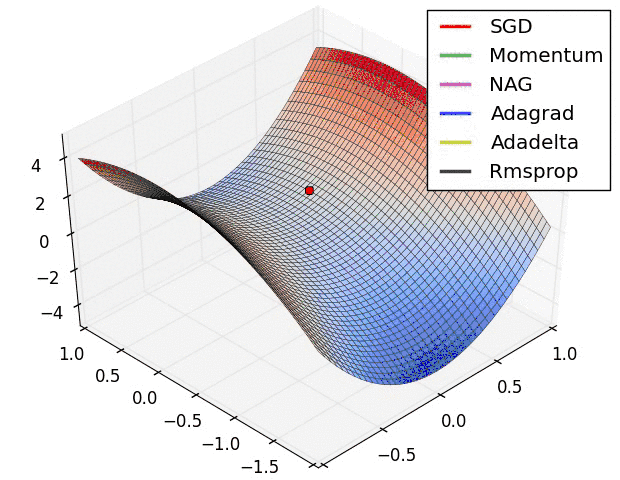
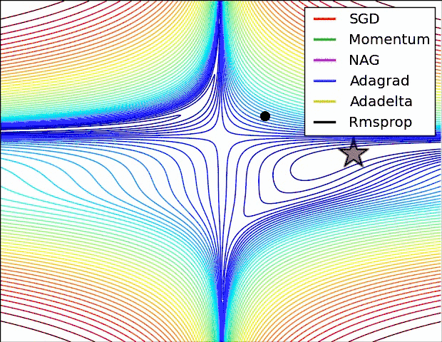

<!-- TOC -->

- [损失函数及优化算法](#损失函数及优化算法)
  - [1.损失函数](#1损失函数)
    - [1.1 均方误差 (mean squared error)](#11-均方误差-mean-squared-error)
    - [1.2 交叉熵误差 (cross entropy error)](#12-交叉熵误差-cross-entropy-error)
    - [1.3 均方误差和交叉熵在神经网络中作为代价函数的对比](#13-均方误差和交叉熵在神经网络中作为代价函数的对比)
  - [2.优化算法](#2优化算法)
    - [2.1 梯度下降法](#21-梯度下降法)
      - [2.1.1 批梯度下降算法 Batch Gradient Descent (BGD)](#211-批梯度下降算法-batch-gradient-descent-bgd)
      - [2.1.2 随机梯度下降算法 Stochastic Gradient Descent (SGD)](#212-随机梯度下降算法-stochastic-gradient-descent-sgd)
      - [2.1.3 小批量梯度下降算法 Mini-Batch Gradient Descent （MBGD）](#213-小批量梯度下降算法-mini-batch-gradient-descent-mbgd)
    - [2.2 动量优化法](#22-动量优化法)
      - [2.2.1 Momentum](#221-momentum)
      - [2.2.2 牛顿加速梯度算法 Nesterov Accelerated Gradient(NAG)](#222-牛顿加速梯度算法-nesterov-accelerated-gradientnag)
    - [2.3. 自适应学习率优化算法](#23-自适应学习率优化算法)
      - [2.3.1 Adagrad（Adaptive gradient algorithm）](#231-adagradadaptive-gradient-algorithm)
      - [2.3.2 Adadelta](#232-adadelta)
      - [2.3.3 RMSprop](#233-rmsprop)
      - [2.3.4 Adam](#234-adam)
    - [2.4 各个优化算法的比较](#24-各个优化算法的比较)

<!-- /TOC -->
# 损失函数及优化算法
## 1.损失函数
神经网络的目的就是以某个指标来寻找最优的权重参数，神经网络的学习中所用的指标被称为损失函数。
>损失函数是表示神经网络性能的“恶劣程度”的指标，即当前的神经网络对监督数据在多大程度上不拟合，在多大程度上不一致。以“性能的恶劣程度”为指标可能会使人感到不太自然，但是如果给损失函数乘上一个负值，就可以解释为“在多大程度上不坏”，即“性能有多好”。并且，“使性能的恶劣程度达到最小”和“使性能的优良程度达到最大”是等价的，不管是用“恶劣程度”还是“优良程度”，做的事情本质上都是一样的。

### 1.1 均方误差 (mean squared error)
$$E=\frac{1}{2}\sum_k(y_k-t_k)^2$$
上述均方误差的公式中，$y_k$代表神经网络的输出，$t_k$表示监督数据，$k$表示数据的维数。
>均方误差就是简单的样本的预测值和参考值的差的平方根，然后再求平均。

### 1.2 交叉熵误差 (cross entropy error)
$$E=-\sum_k(t_klog(y_k))$$
同上，$y_k$代表神经网络的输出，$t_k$表示监督数据，$k$表示数据的维数。
>交叉熵表示的是两个概率之间的距离。

### 1.3 均方误差和交叉熵在神经网络中作为代价函数的对比
均方误差一般用于线性回归，适用于预测数值，即回归模型。
111111
交叉熵误差一般用于逻辑回归，适用于预测概率，即分类问题模型。
> 均方误差作为损失函数时容易出现梯度弥散的问题，而交叉熵误差的求导过程跟梯度的关系不大，就能很好的避免这个问题。
> 
> 对于分类问题来说，如果简单的使用均方误差来求预测值和参考值之间的差距并不是很恰当，而交叉熵表示的是两个概率之间的差距，也就是有可能数值差距大，但是他们的概率相近，因此交叉熵函数在分类模型中要优于均方误差。
---
## 2.优化算法
 对于一个优化算法来说，优化的目标是网络模型中的参数$\theta$(它是一个集合，$\theta_1,\theta_2,\theta_3...$),目标函数则是损失函数$L=\frac{1}{n}\sum{L_i}$(也就是每个样本损失函数的叠加求均值)，损失函数L中的变量就是$\theta$，其中L中的参数就是整个训练集，损失函数是通过整个训练集来确定的。

变量含义：
- $\theta$:模型中的参数
- $\eta$:学习率
- $J(\theta)$:损失函数
- $\bigtriangledown_\theta J(\theta)$:梯度
### 2.1 梯度下降法
#### 2.1.1 批梯度下降算法 Batch Gradient Descent (BGD)
$$\theta = \theta-\eta*\bigtriangledown_\theta J(\theta)$$
disadvantage：
- BGD使用整个训练集的数据来计算损失函数对参数的梯度，也就是在一次更新中对整个数据集计算梯度，所以计算起来非常慢，遇到大量的数据集时十分麻烦，而且不能投入新数据实时的更新模型。

#### 2.1.2 随机梯度下降算法 Stochastic Gradient Descent (SGD)
$$\theta = \theta-\eta*\bigtriangledown_\theta J(\theta;x^{(i)};y^{(i)})$$
和BGD相比，SGD在每次更新时对每个样本（$x^{(i)},y^{(i)}$）进行梯度更新。

advantage：
- 在数据集很大的时候，由于SGD每次只使用一个样本来迭代更新一次，很可能只使用了部分样本就迭代到了最优值，所以SGD不会产生冗余，计算梯度的速度很快，训练速度也很快。

disadvantage：
1. SGD的噪声会比BGD更多，它会导致SGD的迭代不一定每次都是朝最优的方向更新，但在整体期望上它还是等于正确的导数的。
2. SGD以高方差进行快速更新，会造成损失函数出现剧烈的抖动。
3. SGD没能克服局部极小值的问题，它有可能会陷入局部最优。

#### 2.1.3 小批量梯度下降算法 Mini-Batch Gradient Descent （MBGD）
$$\theta = \theta - \eta*\bigtriangledown_\theta J(\theta;x^{(i:i+n)};y^{(i:i+n)})$$
MBGD每一次利用一批样本，即n个样本进行计算。n一般取值为50-256

advantage：
1. 减少了参数更新的变化，因为一批样本对比一个样本误差更小，这样可以带来更加稳定的收敛。
2. 可以充分利用机器学习库中的矩阵优化，使计算更加高效。

disadvantage：
1. 它不能保证很好的收敛性，如果学习率太小，它的收敛速度会很慢，如果学习率太大，它很可能会在极小值处不停的震荡甚至偏离。

---
**梯度下降算法的问题:**
以上的梯度下降的优化算法的学习率都需要预先设置，并且在整个模型中都使用同样的学习率来进行计算，它会带来一系列的问题：
1. 梯度下降算法不能保证很好的收敛性，学习率太小收敛速度会很慢，学习率太大则有可能非常抖动或者达不到最优解，而且它很有可能会陷入局部极小值或者鞍点。
2. 当数据非常稀疏的时候，我们不应该对所有的数据都采用相同的学习率进行更新，我们更希望对极少出现的某些特征作出较大的更新。
---
### 2.2 动量优化法
既然提出了问题，那么自然有解决方案，动量优化法就是在梯度下降的基础上进行的改变，它具有加速梯度下降的作用，能很好的解决梯度下降中出现的第一个问题，能加快收敛速度。
变量含义：
$v_t$:t时刻所积攒的加速度，动量因子
$\lambda$:动力的大小（一般取值为0.9，表示最大速度10倍于SGD）
其他变量同上
####  2.2.1 Momentum
$$v_t=\lambda v_{t-1}+\eta \bigtriangledown_{\theta}J(\theta)$$
$$\theta = \theta-v_t$$
使用动量(Momentum)的随机梯度下降法，它的主要思想就是引入了一个积攒历史梯度信息动量来加速SGD。我们把梯度下降看作是一个小球要滚到山谷的最低点，那么动量的思想就是如果小球朝着谷底的方向滚，那么它的速度就会增加，如果朝别的方向滚，它的速度就会下降，相当于小球具有惯性。当梯度保持相同方向时，动量因子会加速参数更新，而梯度方向改变时，动量因子会降低梯度的更新速度。

advantage：
1. 在一定程度上降低了SGD中的噪声所造成的影响，加快了梯度的更新速度。
2. 解决了SGD在局部极小值的位置可能出现的不停震荡的情况。

#### 2.2.2 牛顿加速梯度算法 Nesterov Accelerated Gradient(NAG)
$$v_t=\lambda v_{t-1}+\eta \bigtriangledown_{\theta}J(\theta-\lambda v_{t-1})$$
$$\theta = \theta-v_t$$
它相当于往标准的动量中加入了一个校正因子，在Momentum中，小球会盲目的跟从下坡的梯度，容易发生错误，所以需要一个更聪明的小球，它能提前预知它要去哪，比如快走到坡底时它会自动减速避免冲上另一个坡。计算$\theta-\lambda v_{t-1}$可以表示小球的下一个位置大概在哪里，从而可以提前知道下一个位置的梯度，然后根据它来更新参数。

advantage:
1. NAG是Momentum的改进版，它会在动量因子累积更新梯度后对梯度作出修正，它提高了模型的收敛率。

### 2.3. 自适应学习率优化算法
上述的两个算法可以做到在更新梯度时顺着损失函数的梯度来调整速度，对SGD进行加速，我们还希望模型能够根据参数的重要性程度而对不同的参数进行不同程度的更新。
#### 2.3.1 Adagrad（Adaptive gradient algorithm）
它能够独立的适应所有模型参数的学习率，缩放每个参数反比于其所有梯度历史平均值总和的平方根。它针对高频特征更新步长较小，而低频特征更新较大，因此它非常适合应用在特征稀疏的场景。
梯度计算公式：
$$g_{t,i}=\bigtriangledown_{\theta J(\theta_{t,i})}$$
Adagrad：
$$\theta_{t+1,i}=\theta_{t,i}-\frac{\eta}{\sqrt{G_{t,i}+\epsilon}}g_{t,i}$$
SGD算法：
$$\theta_{t+1,i}=\theta_{t,i}-\eta g_{t,i}$$
$G_{t,i}$:是一个对角矩阵，(i,i)元素即对角线元素就是t时刻参数$\theta_i$的历史梯度平方和。
**$\eta_0$初始学习率一般取0.01**

disadvantage:
1. 其分母梯度平方的累加和。因为每次加入的都是一个正数，随着训练的进行，学习率将会变得无限小，此时算法将不能进行参数的迭代更新。

#### 2.3.2 Adadelta
Adadelta是Adagrad的改进版，它主要解决了Adagrad算法的学习率单调递减的问题。通过约束历史梯度累加来替代累加所有历史梯度平方。**这里通过在历史梯度上添加衰减因子，并通过迭代的方式来对当前的梯度进行计算，最终距离较远的梯度对当前的影响较小，而距离当前时刻较近的梯度对当前梯度的计算影响较大。**
和 Adagrad 相比，就是分母的 G 换成了过去的梯度平方的衰减平均值，指数衰减平均值
$$\bigtriangleup\theta_t=-\frac{\eta}{\sqrt{E[g^2]_t+\epsilon}}g_t$$
这个分母相当于梯度的均方根 root mean squared (RMS)，在数据统计分析中，将所有值平方求和，求其均值，再开平方，就得到均方根值 ，所以可以用 RMS 简写：
$$\bigtriangleup\theta_t=-\frac{\eta}{RMS[g]_t}g_t$$
其中E的计算公式如下，t 时刻的依赖于前一时刻的平均和当前的梯度：
$$E[g^2]_t=\lambda E[g^2]_{t-1}+(1-\lambda)g^2_t$$
最终我们可以得到以下表达式：
$$\bigtriangleup\theta_t=-\frac{RMS[\bigtriangleup\theta]_{t-1}}{RMS[g]_t}g_t$$
$$\theta_{t+1}=\theta_{t}+\bigtriangleup\theta_t$$
当我们使用Adadelta算法作为模型的优化器算法时，已经不需要设置默认学习率。

#### 2.3.3 RMSprop
RMSproph和adadelta算法都是adagrad算法的优化版，都是用于解决adagrad算法的学习率消失问题的，RMSprop 与 Adadelta 的第一种形式相同：（**使用的是指数加权平均，旨在消除梯度下降中的摆动，与Momentum的效果一样，某一维度的导数比较大，则指数加权平均就大，某一维度的导数比较小，则其指数加权平均就小，这样就保证了各维度导数都在一个量级，进而减少了摆动。允许使用一个更大的学习率$\eta$**）
$$E[g^2]_t=\lambda E[g^2]_{t-1}+(1-\lambda)g^2_t$$
$$\theta_{t+1}=\theta_{t}-\frac{\eta}{\sqrt{E[g^2]_t+\epsilon}}g_t$$
$\lambda$一般设置为0.9，学习率$\eta$一般设置为0.001

#### 2.3.4 Adam
Adam也是一种计算每个参数的自适应学习率的方法，相当于是RMSprop+Momentum，它同样也对历史平均梯度$v_t$乘上了一个衰减因子，同时它还存储了一个历史梯度$m_t$。
$$m_t = \beta_1 m_{t-1}+(1-\beta_1)g_t$$
$$v_t = \beta_2 v_{t-1}+(1-\beta_1)g_t^2$$
$m_t$是一阶动量项(均值)，$v_t$是二阶动量项(方差)，当$m_t$和$v_t$初始化为0向量时，它们都会向0偏置，所以又对他们进行了**偏置校正**，通过计算偏置校正来抵消偏差：
$$\hat{m} = \frac{m_t}{1-\beta^t_1}$$
$$\hat{v} = \frac{v_t}{1-\beta^t_2}$$
梯度更新规则：
$$\theta_{t+1} = \theta_t-\frac{\eta}{\sqrt{\hat{v_t}+\epsilon}}\hat{m_t}$$
**一般设置$\beta_1=0.9,\beta_2=0.999,\epsilon=10^{-8}$**

**实践表明，Adam 比其他适应性学习方法效果要好。**
### 2.4 各个优化算法的比较
 

在普通曲面的比较

在鞍点的比较

在等高线的比较

---
很显然，我们可以看出Adagrad, Adadelta, RMSprop 几乎很快就找到了正确的方向并前进，收敛速度也相当快，而其它方法要么很慢，要么走了很多弯路才找到。

 by wu 

 2019.04.06 
