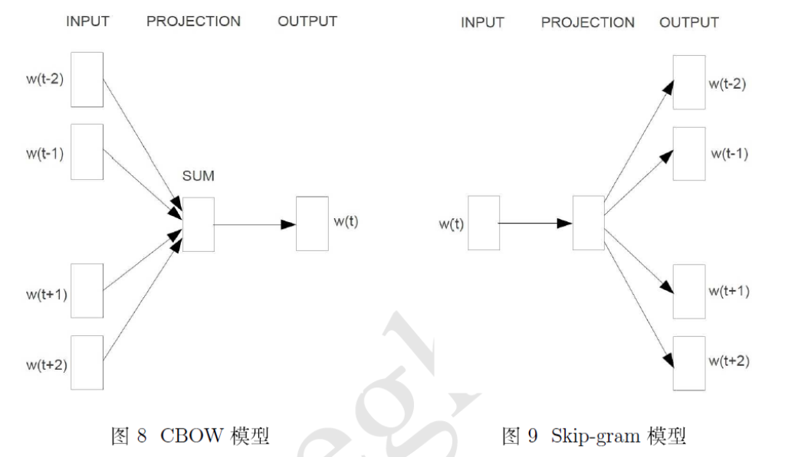
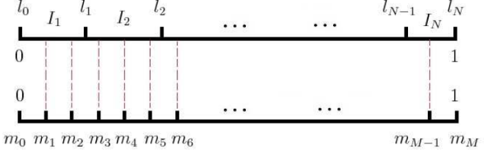

>本文基于[word2vec原理CBOW与Skip-Gram模型基础](https://www.cnblogs.com/pinard/p/7160330.html)
CBOW与Skip-Gram的模型计算的推导待补充(咕咕咕)
# word2vec训练过程
>参考[word2vec简介与训练过程概要](https://blog.csdn.net/thriving_fcl/article/details/51404655)
1. 首先是对语料进行预处理，比如中文语料的分词；去除语料中的停用词等等。
2. 扫描语料库，统计每个词的词频，然后保存到一个hash表里。
3. 根据词频建立Huffman树，Huffman树是一颗最优二叉树。
4. 根据哈夫曼树生成哈夫曼编码，每个叶子节点即词向量都对应一个编码。
5. 初始化非叶子节点的中间向量和叶节点中的词向量。
tips:在训练开始之前，词向量就已经存在，只不过是一个无意义的初始值，通过不断的迭代得到最优的词向量。
6. 训练中间向量和词向量
Huffman树的训练过程相当于多个二分类器的叠加。

# 词向量
## one hot
词的数量等于向量的维度，当前词的位置的维度值为1，其他词的位置为0
例:(0,1,0,0,0,0,0)
**problem:**当词的数量很大时，一个词的词向量可能达到上百万维，内存损耗过大，利用率过低。

## Distributed representation
通过训练，将每个词都映射到一个较短的词向量上去，这样表示这些词的词向量不会过多的损耗内存，而且这些词向量还能构成向量空间，可以便于研究词于词之间的关系。

# CBOW&Skip-Gram
word2vec模型是使用的经典的输入层，隐藏层，输出层（softmax层）的神经网络结构。
word2vec出现前曾使用过DNN训练词向量，但问题是DNN的计算量太大，非常耗时。

#### CBOW
CBOW的输入是某一个特征词的上下文相关的词对应的词向量，而输出是当前这个词，也就是说是通过上下问来预测当前词。
#### Skip-Gram
Skip-Gram的输入是当前词，输出是这个词的上下文的词向量，也就是通过当前词来预测这个词的上下文。

#预备知识
## sigmoid函数
$\sigma(x)=\frac{1}{1+e^{-x}}$
sigmoid函数的值域为(0,1)
tips:因为sigmoid函数一般在(0,1)之间，所以sigmoid函数一般用于输出某个概率值

$\sigma^{'}(x)=\sigma(x)[1-\sigma(x)]$
${[log\sigma(x)]}^{'}=1-\sigma(x)$
${[log(1-\sigma(x))]}^{'}=-\sigma(x)$

二分类的逻辑回归
$\sigma(x^T_\omega\theta)=\frac{1}{1+e^{-x^T_\omega\theta}}$
## Softmax函数
一般用于多分类问题，它将多个神经元的输出，映射到(0,1)区间内，可以把输出看成概率值来进行多分类。
对于训练集{$(x^1,y^1),(x^2,y^2),...,(x^m,y^m)$},我们有$y^i\in\{1,2,...,k\}$,例如minst手写数据集中，k=10，有10个不同的类别。
$S_i=\frac{e^{V_i}}{\sum_i^ce^{V_i}}$
$V_i$是分类器的前级输出单元的输出，i表示当前的类别，类别的总个数为C，$S_i$可以看作输入时i类别的概率。

## Huffman树
word2vec中没有使用传统的DNN模型，而是使用了Huffman树来代替隐藏层和输出层的神经元。
叶子节点  === 输出层神经元
叶子节点的个数 === 词汇表的大小
内部节点 === 隐藏层神经元
如何构建Huffman树？ 略
使用Huffman树的优点，得到Huffman树之后可以立即进行Huffman编码，权重越高的叶子节点越靠近根节点，权重越低的叶子节点远离根节点，Huffman编码的方式会对高权重的编码值较短，对低权重的编码值较长，这样可以保证树的带权路最短，也就是说这样可以让越常用的词的编码更短。

#[基于Hierarchical Softmax的模型](http://www.cnblogs.com/pinard/p/7243513.html)
传统的神经网络词向量语言模型中，一般有3层，输入层，隐藏层和输出层(softmax层)。
其中导致传统神经网络模型计算速度很慢的问题在于从隐藏层到输出的softmax层的计算量很大，因为它需要对所有的词都计算一个softmax概率，然后再去找到其中概率的最大值。
**简单来说，基于Hierarchical Softmax的模型就是使用Huffman树来代替传统的神经网络，极大的提高了模型的训练速度**
****
而word2vec对这个模型作出了改进。
****
**输入层到隐藏层的映射**
没有使用传统神经网络中的线性变换加激活函数的方法，而是采用简单的对所有输入词向量求和然后取平均的方法。
例：输入3个4维向量(1,2,3,4)(9,6,11,8)(5,10,7,12),通过映射到隐藏层后的词向量就是(5,6,7,8),这里是从多个词向量变成了一个词向量。
****
**隐藏层到输出层的映射**
上面已经提到过，传统的模型中的隐藏层到输出的softmax层中会逐个词计算概率，而word2vec中则采样了Huffman树来代替从隐藏层到输出层的映射。

霍夫曼树的所有内部节点就类似之前神经网络隐藏层的神经元,其中，根节点的词向量对应我们的投影后的词向量，而所有叶子节点就类似于之前神经网络softmax输出层的神经元，叶子节点的个数就是词汇表的大小。在霍夫曼树中，隐藏层到输出层的softmax映射不是一下子完成的，而是沿着霍夫曼树一步步完成的，因此这种softmax取名为"Hierarchical Softmax"。

****
**Huffman树的映射方式**
在word2vec中，采用了二元逻辑回归的方法，即规定沿着左子树走就是负类(Huffman编码为1)，沿着右子树走就是正类(Huffman编码为0)，判别正负的方法是使用sigmoid函数：
$P(+)=\sigma(x^T_\omega\theta)=\frac{1}{1+e^{-x^T_\omega\theta}}$
其中$X_\omega$是当前内部节点得词向量，$\theta$是需要从训练样本中求出得逻辑回归的逻辑参数。
***
**使用Huffman树的优点**
- 由于二叉树的特性，计算量从V变成了$log_2V$。
- Huffman树中词频越高的词越靠近根节点，这样越高频的词找到的时间越多，符合贪心的思路。
***
$P(-)=1-P(+)$
在Huffman中，P(-)大则往左走，P(+)大则往右走，而P(+)的大小是由当前节点的词向量和当前节点的模型参数$\theta$决定的。

这是一个训练样本的输出，其中$n(w_2,1)$的P(-)概率大，因此选择走左子树，$n(w_2,2)$同理，$n(w_2,3)$的P(+)概率大，因此选择走右子树，得到输出$w_2$。
***
**Huffman树的梯度计算**
**基于Hierarchical Softmax的CBOW模型和Skip-Gram模型**

***
#[基于Negative Sampling的模型](http://www.cnblogs.com/pinard/p/7249903.html)
**Hierarchical Softmax的缺点：**
它使用Huffman树来提高模型的训练速度，但是如果训练样本的中心词是一个生僻词，那么它每次都要在Huffman树中往下走很久才能得到，会导致训练速度比较慢。
Negative Sampling就是求解word2vec的另一种方式，它选择使用负采样的方法来求解。
***
**负采样(Negative Samoling)**
比如我们有一个训练样本，中心词是$w$,它周围上下文共有$2c$个词，记为$context(w)$。由于这个中心词$w$,的确和$context(w)$相关存在，因此它是一个真实的正例。通过Negative Sampling采样，我们得到$neg$个和$w$不同的中心词$w_i(i=1,2,..neg)$，这样$context(w)$和$w_i$就组成了$neg$个并不真实存在的负例。利用这一个正例和$neg$个负例，我们进行二元逻辑回归，得到负采样对应每个词$w_i$对应的模型参数$θ_i$，和每个词的词向量。
***
**模型的梯度计算&如何使用1个正例和neg个负例进行二元逻辑回归**

***
**Negative Sampling 负采样方法**
如何进行负采样得到neg个负例？:
如果词汇表的大小为V，那么我们就将一段长度为1的线段分成V份，每份都对应词汇表中的一个词。当然对应每个词的线段长度都是不一样的，对应高词频的词的线段长，低词频对应的线段短，每个词对应的线段长度由下面的式子决定：
$len(w)=\frac{count(m)}{\sum_{u\in vocab}count(u)}$
**也就是说线段长度为当前词的词频除以总词频。**在word2vec中，分子和分母都取了3/4次幂：
$len(w)=\frac{count(m)^{3/4}}{\sum_{u\in vocab}count(u)^{3/4}}$
在采样之前，我们将这段长度为1的线段分成M等份，在这里M>>V，这样可以保证每个词对应的线段都会划分成对应的小块。而M份中的每一份都会落在某一个词对应的线段上。
在采样的时候，我们只需要从M个位置中采样出neg个位置就行，此时采样到的每一个位置对应的线段所属的词就是我们的负例词。

在word2vec中，M取值默认为1e8

**基于Negative Sampling的CBOW模型**

**基于Negative Sampling的Skip-Gram模型**

