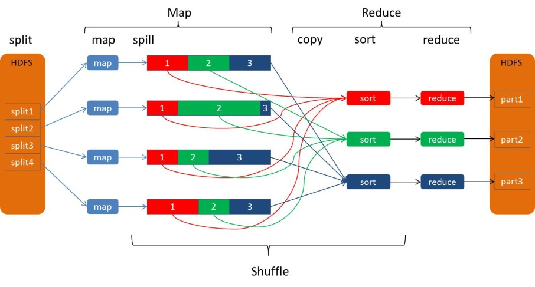
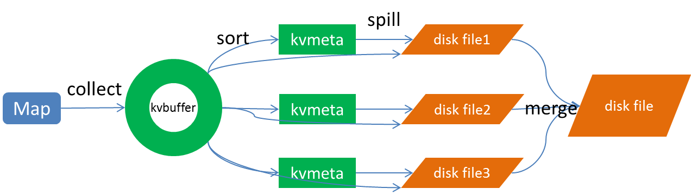

<!-- TOC -->

- [Hadoop](#hadoop)
  - [Hadoop 什么是hadoop？](#hadoop-%E4%BB%80%E4%B9%88%E6%98%AFhadoop)
  - [HDFS Hadoop分布式文件系统](#hdfs-hadoop%E5%88%86%E5%B8%83%E5%BC%8F%E6%96%87%E4%BB%B6%E7%B3%BB%E7%BB%9F)
      - [Blocks](#blocks)
  - [MapReduce 分布式计算框架](#mapreduce-%E5%88%86%E5%B8%83%E5%BC%8F%E8%AE%A1%E7%AE%97%E6%A1%86%E6%9E%B6)
    - [Shuffle过程](#shuffle%E8%BF%87%E7%A8%8B)
  - [YARN 用于作业调度和集群资源管理的框架](#yarn-%E7%94%A8%E4%BA%8E%E4%BD%9C%E4%B8%9A%E8%B0%83%E5%BA%A6%E5%92%8C%E9%9B%86%E7%BE%A4%E8%B5%84%E6%BA%90%E7%AE%A1%E7%90%86%E7%9A%84%E6%A1%86%E6%9E%B6)
  - [运行Hadoop集群需要哪些守护进程？](#%E8%BF%90%E8%A1%8Chadoop%E9%9B%86%E7%BE%A4%E9%9C%80%E8%A6%81%E5%93%AA%E4%BA%9B%E5%AE%88%E6%8A%A4%E8%BF%9B%E7%A8%8B)
  - [ZooKeeper](#zookeeper)
  - [Hbase Hadoop数据库](#hbase-hadoop%E6%95%B0%E6%8D%AE%E5%BA%93)
  - [Kafka](#kafka)
  - [Flume](#flume)
  - [Spark](#spark)
- [Hive 数据仓库](#hive-%E6%95%B0%E6%8D%AE%E4%BB%93%E5%BA%93)

<!-- /TOC -->
# Hadoop
## Hadoop 什么是hadoop？
Hadoop 是一个开源软件框架，用于存储大量数据，并发处理/查询在具有多个商用硬件（即低成本硬件）节点的集群上的那些数据。
Hadoop主要包含以下内容：    
## HDFS Hadoop分布式文件系统
HDFS 允许你以一种分布式和冗余的方式存储大量数据，它具有高容错. 高可靠性. 高可扩展性. 高获得性. 高吞吐率等特征。
#### Blocks
HDFS的Block块比一般单机文件系统大得多，默认为128M。HDFS的文件被拆分成block-sized的chunk，chunk作为独立单元存储。比Block小的文件不会占用整个Block，只会占据实际大小。例如， 如果一个文件大小为1M，则在HDFS中只会占用1M的空间，而不是128M。

**Blocks**抽象的好处：
block的拆分使得单个文件大小可以大于整个磁盘的容量，构成文件的Block可以分布在整个集群， 理论上，单个文件可以占据集群中所有机器的磁盘。 

- 高容错性
  - 数据自动保存多个副本。
  - 某一个副本丢失后，它能自动恢复。
- 适合批处理
  - 它是通过移动计算而不是移动数据。
  - 它会把数据位置暴露给计算框架
- 适合大数据处理
  - 处理数据达到GB,TB甚至PD
  - 能够处理百万规模以上的文件数量
  - 能够处理10k节点的规模
- 流式文件访问
  - 一次写入，多次读取，文件一旦写入不能修改，只能追加。
  - 它保证数据的一致性。
- 可构建在廉价的机器上
  - 它通过多副本机制，提高可靠性。
  - 它提供了容错和恢复机制

但是HDFS同样也有不适用的场景
- 低延时的数据访问 
- 大量小文件
- 多方读写，需要任意的文件修改
    - HDFS采用追加（append-only）的方式写入数据。不支持文件任意offset的修改。不支持多个写入器（writer）。
## MapReduce 分布式计算框架
它以分布式和并行的方式处理大量数据。MapReduce由两个阶段组成：Map和Reduce，用户只需要实现map()和reduce()两个函数，就可以实现分布式计算。

ex: 
1. 读取HDFS中的文件,将它处理成<k,v>的形式，然后输出。
2. 对输出的<k,v>进行分区，默认分为一个区
3. 对不同分区中进行排序（按照k）. 分组。分组指的是相同key的value放到一个集合中。
Reduce过程
4. 多个map任务的输出，按照不同的分区，通过网络复制到不同的reduce节点上。
5. 对多个map的输出进行合并. 排序，覆盖reduce函数，接受分组后的数据，实现业务逻辑后生成新的<k,v>输出，然后将新的输出写到HDFS里。
### Shuffle过程

Map端shuffle
1. 分区partition
2. 写入环形内存缓冲区Spill
3. 执行溢出写
    排序sort--->合并combiner--->生成溢出写文件
4. 归并merge
   1. merge是将所有的溢写文件归并到一个文件，结合上面所描述的combiner的作用范围，归并得到的文件内键值对有可能拥有相同的key，这个过程如果client设置过

Reduce端shuffle
1. 复制copy,使用HTTP的方式拉取数据
2. sort
3. 归并merge
   1. Reducer的输入文件。不断地merge后，最后会生成一个“最终文件”。这个最终文件可能在磁盘中也可能在内存中。当然我们希望它在内存中，直接作为reducer的输入，但默认情况下，这个文件是存放于磁盘中的。当reducer的输入文件已定，整个shuffle才最终结束。然后就是reducer执行，把结果存放到HDFS上。
4. reduce
## YARN 用于作业调度和集群资源管理的框架

## 运行Hadoop集群需要哪些守护进程？
DataNode,NameNode,TaskTracker和JobTracker。
- NameNode是Hadoop的大脑，主要负责管理系统上的分配块，还为客户提出请求时的数据提供特定地址。它还全权管理数据块的复制，它周期性地从集群中的每个Datanode接收心跳信号和块状态报告。接收到心跳信号意味着该Datanode节点工作正常。块状态报告包含了一个该Datanode上所有数据块的列表。
- 作为分布式文件系统的工作节点，BataNode有着以下作用
  - 负责文件系统或者客户端的读写操作
  - 在NameNode的调度下对数据块进行创建. 存储. 删除. 备份等操作。 

## ZooKeeper
ZooKeeper是一个分布式的，开放源码的分布式应用程序协调服务，是Google的Chubby一个开源的实现，它是集群的管理者，监视着集群中各个节点的状态根据节点提交的反馈进行下一步合理操作。最终，将简单易用的接口和性能高效. 功能稳定的系统提供给用户。

它用于管理大型主机。ZooKeeper 的设计目标是将那些复杂且容易出错的分布式一致性服务封装起来，构成一个高效可靠的原语集。在分布式环境中协调和管理服务是一个复杂的过程，而ZooKeeper通过其简单的架构和API解决了这个问题，例如ZK提供了数据发布订阅. 负载均衡. 命名服务. Master选举. 集群管理. 配置管理. 分布式队列和分布式锁等功能。

zookeeper提供了
1. 文件系统,管理（存储. 读取）用户程序提交的数据
2. 通知机制,为用户程序提交数据节点监听服务。

特点总结：
1. 集群部署，容错性高。
   ZooKeeper 本身就是一个分布式程序（只要半数以上节点存活，ZooKeeper 就能正常服务）。
2. 内存设计，高吞吐低延迟。
3. 特别适合读场景，性能好。
4. 临时节点设计，提供监听服务。

## Hbase Hadoop数据库
HBase是一种Hadoop数据库，经常被描述为一种稀疏的，分布式的，持久化的，多维有序映射，它基于行键. 列键和时间戳建立索引，是一个可以随机访问的存储和检索数据的平台。HBase不限制存储的数据的种类，允许动态的. 灵活的数据模型，不用SQL语言，也不强调数据之间的关系。HBase被设计成在一个服务器集群上运行，可以相应地横向扩展。

行索引(Rowkey)
列族(Column Family)
列

## Kafka
Kafka是最初由Linkedin公司开发，是一个分布式. 支持分区的（partition）. 多副本的（replica），基于zookeeper协调的分布式消息系统，它的最大的特性就是可以实时的处理大量数据以满足各种需求场景：比如基于hadoop的批处理系统. 低延迟的实时系统. storm/Spark流式处理引擎，web/nginx日志. 访问日志，消息服务等等，用scala语言编写，Linkedin于2010年贡献给了Apache基金会并成为顶级开源 项目。

kafka的特性：
- 高吞吐量. 低延迟：kafka每秒可以处理几十万条消息，它的延迟最低只有几毫秒，每个topic可以分多个partition, consumer group 对partition进行consume操作。
- 可扩展性：kafka集群支持热扩展
- 持久性. 可靠性：消息被持久化到本地磁盘，并且支持数据备份防止数据丢失
- 容错性：允许集群中节点失败（若副本数量为n,则允许n-1个节点失败）
- 高并发：支持数千个客户端同时读写

## Flume
flume是一个分布式. 可靠. 和高可用的海量日志采集. 聚合和传输的系统。支持在日志系统中定制各类数据发送方，用于收集数据;同时，Flume提供对数据进行简单处理，

## Spark
spark是一个实现快速通用的集群计算平台,它是一个通用内存并行计算框架，用来构建大型的. 低延迟的数据分析应用程序。它扩展了广泛使用的MapReduce计算。
- 高效性
- 易用性
- 通用性
- 兼容性

Spark和Hadoop的区别：

两者都是用mr模型来进行并行计算，hadoop的一个作业称为job，job里面分为map task和reduce task，每个task都是在自己的进程中运行的，当task结束时，进程也会结束

spark用户提交的任务成为application，一个application对应一个sparkcontext，app中存在多个job，每触发一次action操作就会产生一个job

这些job可以并行或串行执行，每个job中有多个stage，stage是shuffle过程中DAGSchaduler通过RDD之间的依赖关系划分job而来的，每个stage里面有多个task，组成taskset有TaskSchaduler分发到各个executor中执行，executor的生命周期是和app一样的，即使没有job运行也是存在的，所以task可以快速启动读取内存进行计算

hadoop的job只有map和reduce操作，表达能力比较欠缺而且在mr过程中会重复的读写hdfs，造成大量的io操作，多个job需要自己管理关系

spark的迭代计算都是在内存中进行的，API中提供了大量的RDD操作如join，groupby等，而且通过DAG图可以实现良好的容错

# Hive 数据仓库
1. Hive 由 Facebook 实现并开源
2. 是基于 Hadoop 的一个数据仓库工具
3. 可以将结构化的数据映射为一张数据库表
4. 并提供 HQL(Hive SQL)查询功能
5. 底层数据是存储在 HDFS 上
6. Hive的本质是将 SQL 语句转换为 MapReduce 任务运行
7. 使不熟悉 MapReduce 的用户很方便地利用 HQL 处理和计算 HDFS 上的结构化的数据，适用于离线的批量数据计算。

数据仓库（Data Warehouse）是一个面 向主题的（Subject Oriented）、集成的（Integrated）、相对稳定的（Non-Volatile）、反映历史 变化（Time Variant）的数据集合，用于支持管理决策(Decision Making Support)。

Hive 依赖于 HDFS 存储数据，Hive 将 HQL 转换成 MapReduce 执行，所以说 Hive 是基于 Hadoop 的一个数据仓库工具，实质就是一款基于 HDFS 的 MapReduce 计算框架，对存储在 HDFS 中的数据进行分析和管理