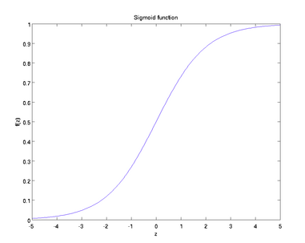
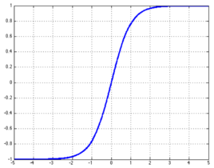
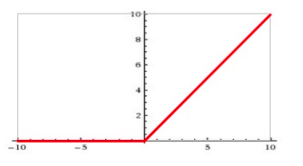

<!-- TOC -->

- [激活函数](#激活函数)
    - [什么是激活函数?](#什么是激活函数)
    - [为什么要使用激活函数？](#为什么要使用激活函数)
    - [不同的激活函数的对比](#不同的激活函数的对比)
        - [sigmoid函数](#sigmoid函数)
        - [Tanh函数](#tanh函数)
        - [ReLU函数](#relu函数)
        - [softmax函数](#softmax函数)

<!-- /TOC -->
# 激活函数
## 什么是激活函数?
激活函数就是神经元中的输入经过加权求和后，再经过一个函数的激活，得到输出，这个函数就是激活函数。

## 为什么要使用激活函数？
如果不用激励函数，每一层输出都是上层输入的线性函数，无论神经网络有多少层，输出都是输入的线性组合。
如果使用的话，激活函数给神经元引入了非线性因素，使得神经网络可以任意逼近任何非线性函数，这样神经网络就可以应用到众多的非线性模型中。

## 不同的激活函数的对比
### sigmoid函数
$$f(z)=\frac{1}{1+\exp(-z)}$$ 

sigmoid函数也就Logistic函数，一般用于隐层神经元输出，取值范围在(0,1)之间，它能将一个实数映射到(0,1)之间，可以用于做二分类问题，而且因为它的输出在(0,1)之间，一般也会用来当作一个概率值或者一个程度，比如LSTM中的遗忘门，0表示完全遗忘，1表示完全不遗忘。

sigmoid的缺点：
- 激活函数的计算量大，反向传播求误差梯度时，求导法则涉及除法。
- 反向传播时很容易出现**梯度消失**的问题，也就是在函数激活值接近0或者-1时梯度接近0，神经网络过深时难以完成训练。
- sigmoid函数的收敛会比较缓慢。
----
### Tanh函数
$$f(z)=tanh(z)=\frac{e^z-e^-z}{e^z+e^-z}$$

双切正切函数，取值范围为[-1,1]，ranh在特征相差明显时效果会很好，因为它存在正负的区别，所以在迭代的过程中会不断的扩大特征效果。

与sigmoid相比，sigmoid不是以0为中心的，我们更偏向输入0时输出也应该是0，而tanh的均值是0，所以它的效果会比sigmoid更好。

但是tanh也并没有接近梯度消失的问题。

---

### ReLU函数
$$\Phi(x) = \max(0,x)$$

ReLU的特点很明显，在小于0时，输出全为0，在大于0时，输出等于输入，即斜率恒为1。

ReLU的优点：
- 梯度不饱和，它在大于0时梯度恒为1.
- 计算速度很快，前两个激活函数在计算时需要计算指数，而它只需要设置阈值。
- 它会造成一部分参数变成0，会造成**网络的稀疏性**，缓解了过拟合问题的发生。

ReLU的缺点：
- 非常脆弱，比如一个很大的梯度流过一个ReLU激活函数后，如果它小于0，那么很可能这个神经元的梯度就一直恒为0了。
---
### softmax函数
$$S_i=\frac{e^{V_i}}{\sum_i^ce^{V_i}}$$
简单来说，softmax就是该元素的指数与所有元素的指数的比值。

softmax一般用于多分类问题，而sigmoid一般用于二分类问题，softmax相当于sigmoid的改进版。