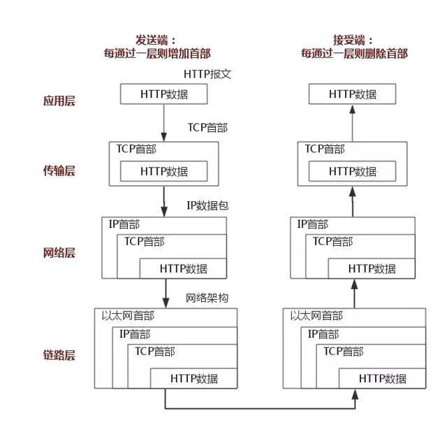
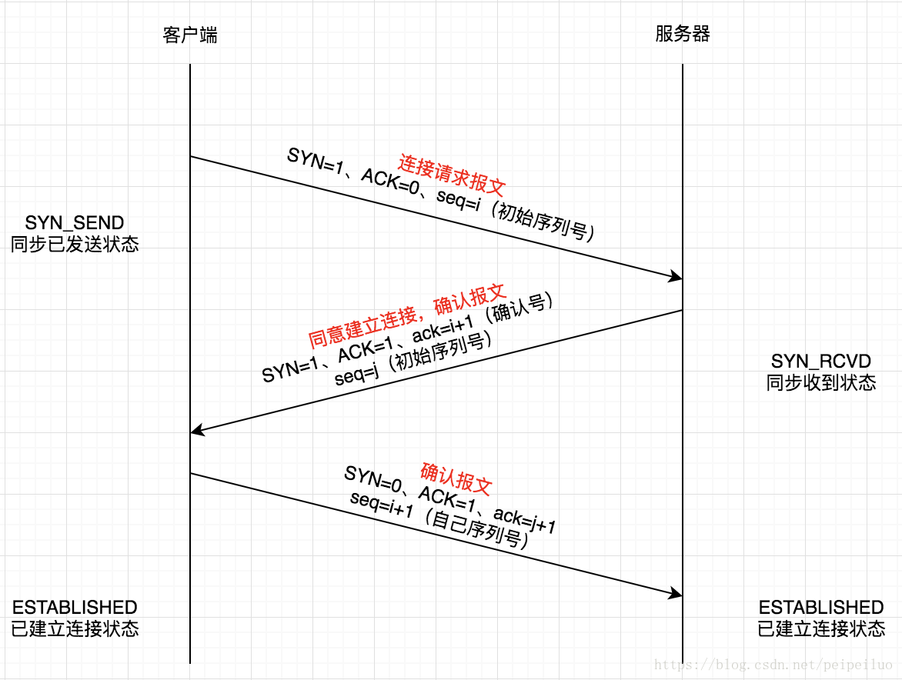
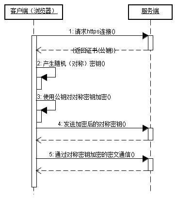
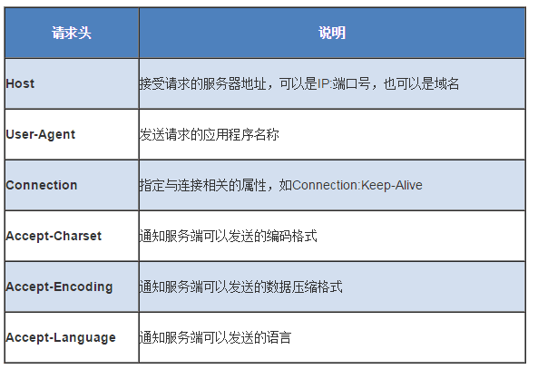

<!-- TOC -->

- [OSI模型](#osi%e6%a8%a1%e5%9e%8b)
- [TCP/IP](#tcpip)
- [TCP与UDP的对比](#tcp%e4%b8%8eudp%e7%9a%84%e5%af%b9%e6%af%94)
- [HTTP状态码](#http%e7%8a%b6%e6%80%81%e7%a0%81)
- [TCP三次握手](#tcp%e4%b8%89%e6%ac%a1%e6%8f%a1%e6%89%8b)
- [TCP四次挥手](#tcp%e5%9b%9b%e6%ac%a1%e6%8c%a5%e6%89%8b)
- [HTTP&HTTPS](#httphttps)
- [cookie & session](#cookie--session)

<!-- /TOC -->
## OSI模型
层|数据传输方式|协议
-|-|-
应用层|APDU(应用协议数据单元)|FTP、DNS、Telnet、SMTP、HTTP、WWW、NFS
表示层|PPDU(表示协议数据单元)|JPEG、MPEG、ASII
会话层|SPDU(会话协议数据单元)|NFS、SQL、NETBIOS、RPC
传输层|segment(段)|TCP、UDP、SPX
网络层|packet(包)|IP、ICMP、ARP、RARP、OSPF、IPX、RIP、IGRP、 （路由器）
数据链路层|frame(帧)|PPP、FR、HDLC、VLAN、MAC （网桥，交换机）
物理层|bit(比特)|RJ45、CLOCK、IEEE802.3 （中继器，集线器）

## TCP/IP
层|协议
-|-|
应用层|http、ftp
传输层|TCP、UDP
网络层|IP
网络接口层|CRC


## TCP与UDP的对比
TCP|UDP
-|-
面向连接的|无连接的
TCP提供可靠的服务|UDP尽可能交付，不提供可靠的服务
TCP面向字节流|UDP是面向报文的
TCP的连接只能是点对点的|UDP支持一对一，一对多，多对一，和多对多的交互通信
TCP是全双工的可靠通信|UDP是不可靠的信道

## HTTP状态码
状态码|含义
-|-
200|一切正常
201|表示请求成功并且服务器创建了新的资源，且其URI已经随Location 头信息返回。
202|服务器已接受请求，但尚未处理
301|被请求的资源已永久移动到新位置。服务器返回此响应（对 GET 或 HEAD 请求的响应）时，会自动将请求者转到新位置。
401|请求要求身份验证，要求用户登录
403|服务器已经理解请求，但是拒绝执行。
404|请求失败，找不到服务器上的资源
500|服务器遇到了一个未曾预料的状况，导致了它无法完成对请求的处理。一般来说，这个问题都会在服务器的程序码出错时出现。
503|服务器临时维护或者过载

## TCP三次握手


名词|解读
-|-
SYN|同步序列号，用来发起一个连接。SYN=1的报文不能携带数据，但是消耗掉一个序号。
ACK|确认标识，ACK=1时确认字段才有效。
seq|序列号，数据包本身的序列号，为了连接后传输数据使用。
ack|对收到的数据包的确认，值是收到的数据包的序列号+1
三次握手流程：
- 第一次握手：客户端C向服务端S发送连接请求报文，该报文首部中的SYN=1，ACK=0，随机选取一个序列号seq=i作为初始序列号。此时，客户端进入SYN_SEND同步已发送状态。
- 第二次握手：服务端收到客户端的连接请求报文，如果同意建立连接，则发送确认报文。确认报文首部中SYN=1、ACK=1、ack=i+1、seq=j（服务端的初始序列号）。此时，服务器进入SYN_RCVD同步收到状态。
- 第三次握手：客户端收到服务端的确认报文之后，会向服务器发送确认报文，告诉服务器收到了它的确认报文并准备建立连接。确认报文首部中SYN=0、ACK=1、ack=j+1、seq=i+1。服务端收到客户端确认报文，此时，服务端进入ESTABLISHED已建立连接状态。

另一个版本：
- 第一次握手：客户端发送syn包(syn=x)到服务器，并进入SYN_SEND状态，等待服务器确认；
- 第二次握手：服务器收到syn包，必须确认客户的SYN（ack=x+1），同时自己也发送一个SYN包（syn=y），即SYN+ACK包，此时服务器进入SYN_RECV状态；
- 第三次握手：客户端收到服务器的SYN＋ACK包，向服务器发送确认包ACK(ack=y+1)，此包发送完毕，客户端和服务器进入ESTABLISHED状态，完成。

## TCP四次挥手
与建立连接的“三次握手”类似，断开一个TCP连接则需要“四次握手”。
- 第一次挥手：主动关闭方发送一个FIN，用来关闭主动方到被动关闭方的数据传送，也就是主动关闭方告诉被动关闭方：我已经不会再给你发数据了(当然，在fin包之前发送出去的数据，如果没有收到对应的ack确认报文，主动关闭方依然会重发这些数据)，但是，此时主动关闭方还可 以接受数据。
- 第二次挥手：被动关闭方收到FIN包后，发送一个ACK给对方，确认序号为收到序号+1（与SYN相同，一个FIN占用一个序号）。
- 第三次挥手：被动关闭方发送一个FIN，用来关闭被动关闭方到主动关闭方的数据传送，也就是告诉主动关闭方，我的数据也发送完了，不会再给你发数据了。
- 第四次挥手：主动关闭方收到FIN后，发送一个ACK给被动关闭方，确认序号为收到序号+1，至此，完成四次挥手。

## HTTP&HTTPS
HTTP：超文本传输协议

HTTPS：安全套接字层超文本传输协议

HTTP|HTTPS
-|-
是互联网上应用最为广泛的一种网络协议，是一个客户端和服务器端请求和应答的标准（TCP），用于从WWW服务器传输超文本到本地浏览器的传输协议，它可以使浏览器更加高效，使网络传输减少。|以安全为目标的HTTP通道，简单讲是HTTP的安全版，即HTTP下加入SSL层，HTTPS的安全基础是SSL，因此加密的详细内容就需要SSL。
http的信息是明文传输的，不提供任何方式的数据加密|https则是具有安全性的ssl加密传输协议。
http使用的是80端口|https使用的是443
http的连接很简单，是无状态的|HTTPS协议是由SSL+HTTP协议构建的可进行加密传输、身份认证的网络协议，比http协议安全。

HTTP的优缺点：
优点|缺点
-|-
使用HTTPS协议可认证用户和服务器，确保数据发送到正确的客户机和服务器；|HTTPS协议握手阶段比较费时，会使页面的加载时间延长近50%，增加10%到20%的耗电；
HTTPS协议是由SSL+HTTP协议构建的可进行加密传输、身份认证的网络协议，要比http协议安全，可防止数据在传输过程中不被窃取、改变，确保数据的完整性。|HTTPS连接缓存不如HTTP高效，会增加数据开销和功耗，甚至已有的安全措施也会因此而受到影响；
HTTPS是现行架构下最安全的解决方案，虽然不是绝对安全，但它大幅增加了中间人攻击的成本。|SSL证书需要钱，功能越强大的证书费用越高，个人网站、小网站没有必要一般不会用。SSL证书通常需要绑定IP，不能在同一IP上绑定多个域名，IPv4资源不可能支撑这个消耗。
谷歌曾在2014年8月份调整搜索引擎算法，并称“比起同等HTTP网站，采用HTTPS加密的网站在搜索结果中的排名将会更高”。|HTTPS协议的加密范围也比较有限，在黑客攻击、拒绝服务攻击、服务器劫持等方面几乎起不到什么作用。最关键的，SSL证书的信用链体系并不安全，特别是在某些国家可以控制CA根证书的情况下，中间人攻击一样可行。


1. 客户使用https的URL访问Web服务器，要求与Web服务器建立SSL连接。
2. Web服务器收到客户端请求后，会将网站的证书信息（证书中包含公钥）传送一份给客户端。
3. 客户端的浏览器与Web服务器开始协商SSL连接的安全等级，也就是信息加密的等级。
4. 客户端的浏览器根据双方同意的安全等级，建立会话密钥，然后利用网站的公钥将会话密钥加密，并传送给网站。
5. Web服务器利用自己的私钥解密出会话密钥。
6. Web服务器利用会话密钥加密与客户端之间的通信。


https://www.nowcoder.com/ta/review-frontend/review?tpId=80&tqId=32030&query=&asc=true&order=&page=100
请求头部的最后会有一个空行，表示请求头部结束，接下来为请求数据，这一行非常重要，必不可少。
3.请求数据
可选部分，比如GET请求就没有请求数据。
下面是一个POST方法的请求报文：
```
POST 　/index.php　HTTP/1.1                                                                　　 请求行
Host: localhost
User-Agent: Mozilla/5.0 (Windows NT 5.1; rv:10.0.2) Gecko/20100101 Firefox/10.0.2　　请求头
Accept: text/html,application/xhtml+xml,application/xml;q=0.9,/;q=0.8
Accept-Language: zh-cn,zh;q=0.5
Accept-Encoding: gzip, deflate
Connection: keep-alive
Referer: http://localhost/
Content-Length：25
Content-Type：application/x-www-form-urlencoded
　　空行
username=aa&password=1234　　请求数据
```
## cookie & session
Cookie和session都可用来存储用户信息，cookie存放于客户端，session存放于服务器端，因为cookie存放于客户端有可能被窃取，所以cookie一般用来存放不敏感的信息，比如用户设置的网站主题，敏感的信息用session存储，比如用户的登陆信息，session可以存放于文件，数据库，内存中都可以，cookie可以服务器端响应的时候设置，也可以客户端通过JS设置cookie会在请求时在http首部发送给客户端，cookie一般在客户端有大小限制，一般为4K，
下面从几个方向区分一下cookie，localstorage，sessionstorage的区别

1、生命周期：

Cookie：可设置失效时间，否则默认为关闭浏览器后失效

Localstorage:除非被手动清除，否则永久保存

Sessionstorage：仅在当前网页会话下有效，关闭页面或浏览器后就会被清除

2、存放数据：

Cookie：4k左右

Localstorage和sessionstorage：可以保存5M的信息

3、http请求：

Cookie：每次都会携带在http头中，如果使用cookie保存过多数据会带来性能问题

其他两个：仅在客户端即浏览器中保存，不参与和服务器的通信

4、易用性：

Cookie：需要程序员自己封装，原生的cookie接口不友好

其他两个：即可采用原生接口，亦可再次封装

5、应用场景：

从安全性来说，因为每次http请求都回携带cookie信息，这样子浪费了带宽，所以cookie应该尽可能的少用，此外cookie还需要指定作用域，不可以跨域调用，限制很多，但是用户识别用户登陆来说，cookie还是比storage好用，其他情况下可以用storage，localstorage可以用来在页面传递参数，sessionstorage可以用来保存一些临时的数据，防止用户刷新页面后丢失了一些参数，

盒子模型
> CSS盒模型本质上是一个盒子，封装周围的HTML元素，它包括：边距，边框，填充，和实际内容。
标准盒模型：一个块的总宽度=width+margin(左右)+padding(左右)+border(左右)

怪异盒模型：一个块的总宽度=width+margin（左右）（既width已经包含了padding和border值）

如何设置：box-sizing:border-box